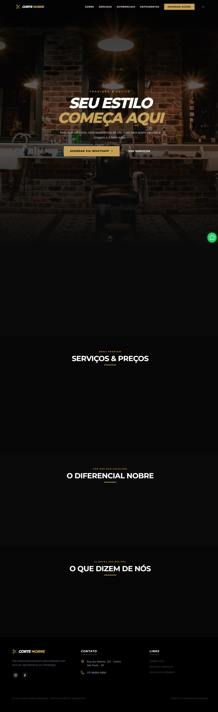

# Corte Nobre Barbearia

Site institucional premium para uma barbearia com foco em conversão por WhatsApp, presença comercial forte e experiência mobile-first.

## Demonstração

- Link do projeto: https://barbearia-nobre-ten.vercel.app/
- Interface pública: home, serviços, diferenciais e depoimentos
- Área administrativa: modo demonstração quando o Supabase não está configurado

## O que este projeto resolve

O projeto transforma a apresentação da barbearia em uma landing page comercial clara, rápida e responsiva. O objetivo é facilitar o agendamento, reforçar a percepção de qualidade e mostrar autoridade local.

## Solução aplicada

- Hero com proposta direta e CTA para WhatsApp
- Seções de prova social e diferenciais
- Menu mobile com navegação simples
- Área administrativa para gerenciamento de serviços
- SEO básico, acessibilidade e organização para deploy estático

## Tecnologias usadas

- React
- TypeScript
- Vite
- Tailwind CSS
- Motion
- Lucide React
- Supabase

## Screenshots

### Desktop



### Mobile


## Como rodar localmente

### Pré-requisitos

- Node.js 18+
- npm

### Instalação

```bash
npm install
```

### Desenvolvimento

```bash
npm run dev
```

Abra `http://localhost:3000`.

### Build de produção

```bash
npm run build
npm run preview
```

## Variáveis de ambiente

O painel administrativo usa Supabase. Se quiser habilitar login e persistência:

```bash
VITE_SUPABASE_URL=sua_url
VITE_SUPABASE_ANON_KEY=sua_chave_anon
```

Sem essas variáveis, o projeto entra em modo demonstração e continua funcionando para a vitrine pública.

## Checklist de testes

Veja o arquivo [TEST-CHECKLIST.md](TEST-CHECKLIST.md).

## Deploy

O projeto foi preparado para Vercel como site estático.

## Estrutura

- `src/App.tsx`: interface principal
- `src/lib/supabase.ts`: cliente Supabase com fallback seguro
- `public/`: assets estáticos, sitemap e robots
- `screenshots/`: imagens usadas na documentação

## Melhorias futuras

- Painel administrativo completo com autenticação real
- Agendamento com horários disponíveis
- Integração com Google Maps e rota de atendimento
- Depoimentos puxados de uma base real
- Otimização de imagens e geração automática de OG image
